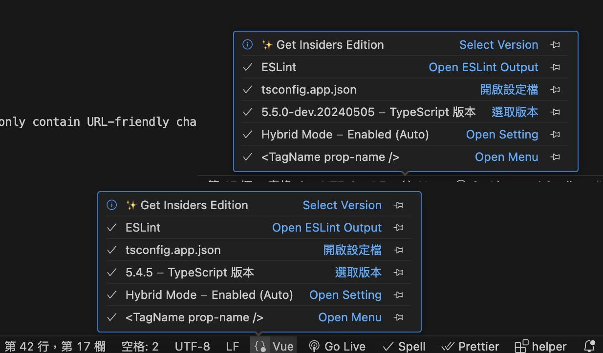

# composition with typescript

## 轉換 ts

在 setup script 預設是 js 當加上 lang=ts 後，理應會出現類型檢查，如有錯誤會在“問題”，出現“xxxx ts-plugin”等提示，如果沒有出現請重新安裝可能插件並重啟 IDE。

### 運行時檢查 type

在 setup script 預設是 js 當加上 lang=ts 後，理應會出現類型檢查，如有錯誤會在“問題”，出現“xxxx ts-plugin”等提示。

- 預設情況下 .ts 都會出現自動檢查，但是.vue 中的 ts 沒辦法
- 如果.vue 沒有出現請重新安裝可能插件並重啟 IDE，重啟時下方會出現‘初始化 JS/TS’會觸發檢查（應是 vscode 內建？）
- .vue 需要用命令手動觸發 TS 伺服器重啟（應是 vscode 內建？）才能檢查

### 自動檢查 .vue 中的 ts

試過很多方法去設定 ESLint 似乎就是沒有辦法觸發儲存自動檢查，可能還有 js/ts 並存問題。

- [] 相關問題 OPEN [Some rules enforced in .ts but not .vue? #18](https://github.com/vuejs/eslint-config-typescript/issues/18)
- [] 試著裝更多插件"typescript-eslint" "@typescript-eslint/parser" "vite-plugin-eslint" 似乎都無法解決

### ESLint 的檢查設定黨與規則

一般是使用 '@vue/eslint-config-typescript'

- [ ]不知道為什麼我用一般的設定，並沒有抓出 vue-tsc 會出現的 ts-plugin 的檢查。

#### '@vue/eslint-config-typescript/recommended 未解問題

如果換成 '@vue/eslint-config-typescript/recommended'會更加嚴格。

- 這些出自於 typescript-eslint [typescript-eslint |擴展說明] (https://typescript-eslint.io/users/configs/)

```
module.exports = {
  root: true,
  "plugins": ["vuejs-accessibility"],
  extends: [
    'plugin:vue/vue3-essential',
    'eslint:recommended',
    '@vue/eslint-config-typescript', / // [!code warning]
    '@vue/eslint-config-typescript/recommended', / // [!code error]
    '@vue/eslint-config-prettier/skip-formatting',
    "plugin:vuejs-accessibility/recommended",
  ],

```

- [ ] 規則 https://typescript-eslint.io/rules/no-explicit-any/ 這一個會把 any 抓出來
- [ ] 還會抓到一堆奇怪的問題 例如 vue 中的 template 出現錯誤等等。

### 安裝插件來解決這問題

- 安裝插件 [ JavaScript and TypeScript Nightly extension.](https://code.visualstudio.com/docs/typescript/typescript-compiling#_using-newer-typescript-versions)

- 點擊下方 vue 的小按鈕，會發現 typescript 版本就升到最新，這也是官方推薦去使用較新的 TypeScript 版本，並預設使用它在工作區中提供 IntelliSense。
- 
- 測試發現針對自動檢查 .vue 中的 ts/js 切換也能快速檢查

> 後記：原本可以檢查了，但開啟一段時間又失效了....跟上面一樣 切換檢查都會異常？？？

### defineProps 轉換

參考 [TypeScript 与组合式 API|复杂的 prop 类型](https://cn.vuejs.org/guide/typescript/composition-api.html)

- 簡單結構：兩種寫法都可以，但只能擇一使用

```
// defineProps({  //运行时声明
//   cartTotalQty: Number,
// });
defineProps<{  //“基于类型的声明”。编译器会尽可能地尝试根据类型参数推导
  cartTotalQty: number
}>()

```

- 复杂的 prop 类型：原本類型是直接定義在 defineProps，但是要變成在`<>`裡或是使用 `as PropType<>` 來作轉換

```
<script setup lang="ts">
// defineProps({  //js寫法
//   item: Object,
// });

 defineProps<{   //ts寫法1:在`<>`裡
   item: {
     title: string;
   }
 }>()


//ts寫法2: 使用 PropType : 一說是可以進行更多的型別檢查和安全性檢查？
import type { PropType } from 'vue'

// defineProps({
//   item: Object as PropType<{ 錯誤寫法？ 看來跟官網範例很像？
//     title: string;
//   }>,
// });

defineProps({
  item: {
    type: Object as PropType<{ title: string }>,
    required: true
  }
})
</script>
```

### defineExpose 轉換

參考 [为组件模板引用标注类型](https://cn.vuejs.org/guide/typescript/composition-api.html)

- modal 中具有 defineExpose

```
<script setup lang="ts">
import { ref } from 'vue'
import { useModal } from '@/composables/useModal'
import type { CartTempItem } from '@/utils/type';
defineProps<{
  item: CartTempItem;
}>();
const modal = ref(null)
const { showModal, hideModal } = useModal(modal);
defineExpose({
  showModal, hideModal
})
</script>
```


- 引用的地方，定義 `ref<InstanceType<typeof MyModal> | null>(null)`，或者你并不关心组件的具体类型，那么可以使用 ComponentPublicInstance

```

const removeItemRef = ref<null>; /// [!code --]
const removeItemRef = ref<InstanceType<typeof RemoveCartConfirm> | null>(null);/ // [!code ++]
const removeConfirm = (item: CartTempItem) => {
  tempItem.value = { ...item };

  const confirmModal = removeItemRef.value
  if (confirmModal) {
    (confirmModal).showModal();
  }

};

```

### 初始物件

- product 一開始可能是{}
```
product 一開始可能是{}
// 使用 Partial<Product> 來允許初始值為空物件
const product: Ref<Product> = ref({});
const product: Ref<Partial<Product>> = ref({});

```

