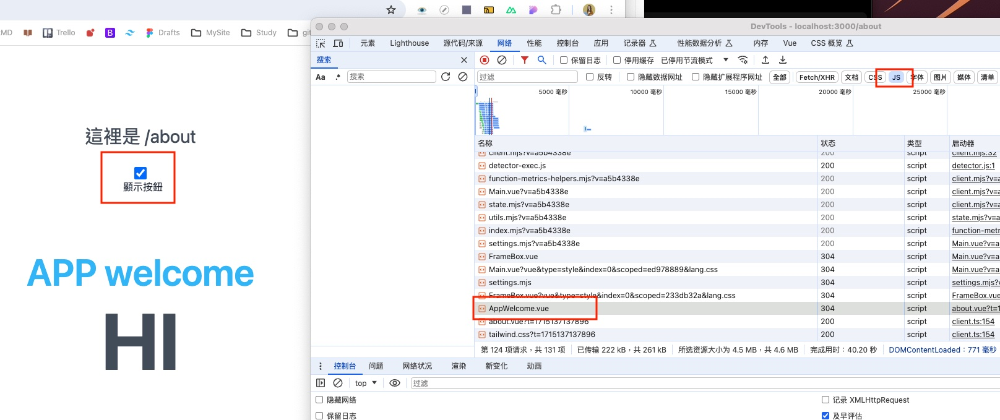

# Nuxt 3

## 目錄與專案結構

大多資料夾初始狀態並不存在，須自行建立。

```
[你的專案名稱]/
├── .nuxt/
├── .output/     build 過後會出現
├── assets/
├── components/    Nuxt 會自動載入這個目錄中的任何元件。
├── composables/
├── content/  可以在這個目錄下建立 .md、.yml、.csv 和 .json 檔案
├── layouts/  佈局模板
├── middleware/
├── server/   建置 server api/routes/middleware/
等等等
TODO
```

## 頁面 (Pages) 與路由 (Routing)

- `pages` 資料夾中建立檔案，檔案名稱對應路由名稱

### 第一個頁面 index

- 當我們建立 `./pages/index.vue`，檔案，則表示路由 `/` 對應到這個頁面檔案。
- 建立 `./pages/about.vue` 對應 `/about`

### 路由頁面

Vue Router 中的 `<router-view />`，這是路由需要的進入點，同樣的在 Nuxt 3 我們需要使用 `<NuxtPage />` 來顯示我們建立的路由頁面，這裡非常重要，否則路由及頁面將無法正確運作。

```
<template>
  <div>
    <NuxtPage />
  </div>
</template>

```

接著我們在瀏覽器瀏覽 `/` 路由，如 `http://localhost:3000/`，就可以看到我們在 `./pages/index.vue` 頁面內寫的標題文字「這是首頁」囉！

### 建立路由連結

加上路由連結

```
<h1 class="text-6xl font-semibold text-gray-800">這裡是首頁</h1>
<NuxtLink to="/about">前往 About</NuxtLink>
```

> 自動產生的路由檔案會在 build 後.output/server/chunks/build/server.mjs 裏面的 const \_routes 會有類似 vue 中的路由配置檔案。

## 布局模板 (Layouts)

TODO

## 元件 (Components)

- `components` 資料夾中建立檔案，檔案名稱會變成組件名稱，任何地方都不需要載入就可以用了
- 元件名稱可以使用大駝峰式命名法 (Pascal Case) 或烤肉串命名法 (Kebab Case) 來為元件命名。EX: base-apply-button.vue

```
/ // [!code highlight] 建立檔案
./components/AppWelcome.vue //建立檔案在這資料夾下
<AppWelcome />  //其他檔案直接加入

/ // [!code highlight] 多層檔案
./components/base/apply/Button.vue
就會是由目錄與檔案名稱組合出的 <BaseApplyButton>。
建議將檔案名稱設置與使用元件時的名稱相同，Nuxt 會幫我們刪除重複的字段
./components/base/apply/BaseApplyButton.vue

```

### 動態元件 (Dynamic Components)

使用 Vue 提供的 resolveComponentVue 方法來進行輔助

### 動態載入 (Dynamic Imports)/延遲載入 (lazy-loading)

在使用元件時，加上前綴 Lazy，首次載入並不會去抓取 AppWelcome.vue，到了按下時要顯示元件才會去抓取。如果沒有加上 Lazy，該元件就算沒有顯示在初次畫面也會載入。

> 降低首次進入網頁時需要下載的 JavaScript 程式碼大小。

```
<template>
  <div class="bg-blue py-24">
    <div class="flex flex-col items-center">
      <p class="my-8 text-3xl text-gray-600">這裡是 /about</p>
      <input id="show-button" v-model="show" name="show-button" type="checkbox" class="h-5 w-5" />
      <label for="show-button" class="ml-2 block text-base text-slate-800">顯示按鈕</label>
      <!-- <AppWelcome v-if="show" /> -->
      <LazyAppWelcome v-if="show" />  / // [!code ++] 把AppWelcome換成 LazyAppWelcome才可以看到效果
      <AppWelcomeXX />  / // [!code error] 打錯命名顏色不同 頁面不會有錯誤正常渲染，log 會有warn 提示。
    </div>
  </div>
</template>

<script setup lang="ts">
const show = ref(false);
</script>


```

- 打開開發者模式-> 網路-> JS -> 可以看到 AppWelcome.vue 載入時間點。
  - 

### ClientOnly 元件 + fallback 插槽 (Slot)

- `Slots#fallback`: specify a content to be rendered on the server and displayed until `<ClientOnly>` is mounted in the browser.

```
<AppWelcome />   // [!code warning]  server 預渲染
<ClientOnly>  // [!code ++]
  <AppWelcome />  // [!code error]  client 客戶端渲染 see me later
  <template #fallback>  // [!code ++]
    <p >載入中...</p> // [!code warning]  server 預渲染
  </template>
</ClientOnly>

```

當這個程式碼載入時，你會先看到“載入中”字樣，等待一會後才渲染出 ClientOnly 中的 AppWelcome。

> Debug CSR/ Pre-Rendering 預渲染 生成 HTML 的差異
>
> 1.  檢視網頁原始碼：會看到一團程式碼，這邊會看到沒有包在 ClientOnly 裏面的會顯示在裡面，另外"載入中" 也會顯示在裡面，但是`客戶端元件的內容不在裡面`。
> 2.  [禁用 js 方法](https://developer.chrome.com/docs/devtools/javascript/disable?hl=zh-tw)：開發者工具 -> Ctrl (Cmd) + Shift + P -> 選擇 Disable/Enable JavaScript。當你禁用後
>     ，`你很明顯可以看到預先會拿到顯示的內容是什麼，客戶端元件就顯示不出來`。

### ` .client`與 `.server` 後綴元件

- 可以使用`.client` suffix 後綴命名檔案會有 ClientOnly 一樣的效果。
- Server & Client components 可以同時使用`.client`與`.server`，這樣 server 會先渲染，完成後會覆蓋！server 消失變成顯示.client 內容

```
  <!-- NOTE: 使用 AppClient.client.vue 差異 -->
      <AppClient />
  <!-- NOTE: 使用 AppClientServer.client.vue 與 AppClientServer.server.vue 差異 -->
   <AppClientServer />

```

## server 資料夾

The [server/ directory](https://nuxt.com/docs/guide/directory-structure/server) is used to register API and server handlers to your application.

- 底下的檔案可以是 ts 或 js

```
-| server/
---| api/  建立 server API，會建立以 /api/ 路由的 API
-----| hello.ts      # /api/hello
---| routes/   建立 伺服器路由，會建立不以 /api/ 路由的 API
-----| bonjour.ts    # /bonjour
---| middleware/
-----| log.ts        # log all requests

```

### 建立 Server API

在.server 底下建立 api 資料夾，會建立以 /api/ 路由的 API

- 建立 hello.ts

  - 打開 http://localhost:3000/api/hello ,如果沒有內容會出現 Nuxt 預設 500 頁面，用 API 打/api/hello 會回覆 500 json 預設錯誤內容
  - 建立內容：預設定義 defineEventHandler，接收 event 參數，回傳值可為 JSON data, a Promise, or use event.node.res.end()

  ```
  export default defineEventHandler((event) => {
  return {
    hello: 'world'
  };
  });

  ```

- 建立完訪問就會的到 JSON，甚至可以在內部用其他的檔案去呼叫

```
pages/index.vue
<script setup lang="ts">
const { data } = await useFetch('/api/hello') //useFetch 是Nuxt內建 可以看資料獲取章節
</script>

<template>
  <pre>{{ data }}</pre>
</template>
```

### 伺服器路由

To add server routes without /api prefix, put them into ~/server/routes directory.

- 剛剛~/server/api 建立的 hello.ts 會有/api/的前綴，如果你不想要有就放到 ~/server/routes
- ~/server/routes/hello.ts 就會是 http://localhost:3000/hello 可以訪問到跟上面一樣結果。

### 中間件

Nuxt will automatically read in any file in the ~/server/middleware to create server middleware for your project.

- server/middleware/log.ts 記錄請求 log，在 useFetch 後可以看到 log。直接訪問伺服器路由沒有看到。

### 路由參數

- Route Parameters:/api/hello/[name].ts and be accessed via event.context.params.

### 路由方法

- Matching HTTP Method:Handle file names can be suffixed with .get, .post, .put, .delete, ... to match request's HTTP Method.

### 請求 body 處理

- server/api/submit.post.ts

```
export default defineEventHandler(async (event) => {
  const body = await readBody(event)
  return { body }
})

```

- 請求端就可以送 body 過來

```
<script setup lang="ts">
async function submit() {
  const { body } = await $fetch('/api/submit', {
    method: 'post',
    body: { test: 123 }
  })
}
</script>


```

- 更多請見[server#query-parameters](https://nuxt.com/docs/guide/directory-structure/server#query-parameters)

## 資料獲取

Nuxt comes with two composables and a built-in library to perform [data-fetching](https://nuxt.com/docs/getting-started/data-fetching) in browser or server environments: useFetch, useAsyncData and
$fetch.

### 用法差異

- useFetch 是在元件設定函數 setup function 中處理資料取得的最直接的方法
- $fetch 非常適合根據用戶互動發出網路請求。
- useAsyncData, 與 $fetch 結合，提供更細緻的控制。

### $fetch

Nuxt includes the ofetch library, and is auto-imported as the $fetch alias globally across your application.

#### 基本範例

> Nuxt 是一個可以在伺服器和用戶端環境中執行同構（或通用）程式碼的框架。如果在 Vue 元件的 setup 函數中使用 $fetch 函數來執行資料獲取，這可能會導致資料被獲取兩次，一次在伺服器上（渲染 HTML），另一次在客
> 戶端（當 HTML 被渲染時）。 ）。這就是 Nuxt 提供特定資料獲取可組合項的原因，因此資料僅獲取一次。

- 用法須參考 [ofetch(ohmyfetch)](https://github.com/unjs/ofetch)
- 測試頁：刷新頁面的話，數字會先加一（沒看到 API 不知道哪來），後端 API 發出但等待中，完成後又加一

```sh
<script setup lang="ts">
const body = await $fetch('/api/hello');
const count = await $fetch('/api/count');
</script>
```

### useAsyncData

- The [useAsyncData](https://nuxt.com/docs/getting-started/data-fetching#useasyncdata) composable is responsible for wrapping async logic and returning the result once it is resolved.

#### 基本範例

- 接收值第一個是 用於緩存的獨立 key，可以不給會自動產生
- 第二個參數是非同步函示必須返回真值（不應是 undefined or null 否則可能在客戶端重複）
- 第三個參數是 `options?: AsyncDataOptions<DataT>`
- 回傳值 `AsyncData<DataT>`，內含 data, pending, error, refresh

```ts
//pages/users.vue

  <script setup lang="ts">
  const { data, error } = await useAsyncData('users', () => myGetFunction('users'))

// This is also possible:
const { data, error } = await useAsyncData(() => myGetFunction('users'))
</script>

//pages/users/[id].vue

<script setup lang="ts">
const { id } = useRoute().params

const { data, error } = await useAsyncData(`user:${id}`, () => {
  return myGetFunction('users', { id })
})
</script>

```

#### 與`＄fetch` 結合

The useAsyncData composable is a great way to wrap and wait for multiple $fetch requests to be completed, and then process the results.

```ts
<script setup lang="ts">
const { data: discounts, pending } = await useAsyncData('cart-discount', async () => {
  const [coupons, offers] = await Promise.all([
    $fetch('/cart/coupons'),
    $fetch('/cart/offers')
  ])

  return { coupons, offers }
})
// discounts.value.coupons
// discounts.value.offers
</script>

```

#### Type 細節

[useAsyncData](https://nuxt.com/docs/api/composables/use-async-data) provides access to data that resolves asynchronously in an SSR-friendly composable.

- Type
  - useAsyncData 有兩個重載，差別在於 key,

```TS
function useAsyncData<DataT, DataE>(
  handler: (nuxtApp?: NuxtApp) => Promise<DataT>,
  options?: AsyncDataOptions<DataT>
): AsyncData<DataT, DataE>
function useAsyncData<DataT, DataE>(
  key: string,
  handler: (nuxtApp?: NuxtApp) => Promise<DataT>,
  options?: AsyncDataOptions<DataT>
): Promise<AsyncData<DataT, DataE>

type AsyncDataOptions<DataT> = {
  server?: boolean
  lazy?: boolean
  immediate?: boolean
  deep?: boolean
  dedupe?: 'cancel' | 'defer'
  default?: () => DataT | Ref<DataT> | null
  transform?: (input: DataT) => DataT | Promise<DataT>
  pick?: string[]
  watch?: WatchSource[]
  getCachedData?: (key: string, nuxtApp: NuxtApp) => DataT
}

type AsyncData<DataT, ErrorT> = {
  data: Ref<DataT | null>
  pending: Ref<boolean>
  refresh: (opts?: AsyncDataExecuteOptions) => Promise<void>
  execute: (opts?: AsyncDataExecuteOptions) => Promise<void>
  clear: () => void
  error: Ref<ErrorT | null>
  status: Ref<AsyncDataRequestStatus>
};

interface AsyncDataExecuteOptions {
  dedupe?: 'cancel' | 'defer'
}

type AsyncDataRequestStatus = 'idle' | 'pending' | 'success' | 'error'


```

#### useLazyAsyncData

預設情況下，useAsyncData 會阻止導航，直到其非同步處理程序得到解析。[useLazyAsyncData](https://nuxt.com/docs/api/composables/use-lazy-async-data) 提供了 useAsyncData 的封器（wrapper），透過將 lazy
option 設為 true，在解析處理程序之前觸發導覽。

> 上面 useAsyncData 的 lazy 設定為 true，會卡住渲染，等完成後才出現整個頁面才出現，useLazyAsyncData 就會先渲染，再改要渲染數字。

- 這樣一來就會先渲染整個頁面，數字一開始是舊資料，然後會變成新資料
- 所以可以設定預設值“-”在請求回來前會顯示，或是利用 pending，提升使用者體驗

```js
//利用 default 請求回來前顯示 -

const { data } = useLazyAsyncData("count", () => $fetch("/api/count"), {
  default: () => "-",
});

//利用 pending 請求回來前顯示 Loading
{
  {
    pending ? "Loading" : data;
  }
}

const { data, pending } = useLazyAsyncData("count", () => $fetch("/api/count"));
```

### useFetch

The [useFetch](https://nuxt.com/docs/getting-started/data-fetching#usefetch) composable is the most straightforward way to perform data fetching.

#### 基本範例

- This composable is a wrapper around the useAsyncData composable and $fetch utility.
  - 接收第一個參數是 url
  - 第二個參數是 Options(請求相關內容與繼承自 useAsyncData 的 options 一樣的選項)
  - 回傳 `Promise<AsyncData<DataT, ErrorT>>` 與帶 key 的 useAsyncData 一樣

```ts
<script setup lang="ts">
const { data: count } = await useFetch('/api/count')
</script>

<template>
  <p>Page visits: {{ count }}</p>
</template>


```

#### Type 細節

```ts
function useFetch<DataT, ErrorT>(
  url: string | Request | Ref<string | Request> | () => string | Request,
  options?: UseFetchOptions<DataT>
): Promise<AsyncData<DataT, ErrorT>>

type UseFetchOptions<DataT> = {
  key?: string
  method?: string
  query?: SearchParams
  params?: SearchParams
  body?: RequestInit['body'] | Record<string, any>
  headers?: Record<string, string> | [key: string, value: string][] | Headers
  baseURL?: string
  server?: boolean
  lazy?: boolean
  immediate?: boolean
  getCachedData?: (key: string, nuxtApp: NuxtApp) => DataT
  deep?: boolean
  dedupe?: 'cancel' | 'defer'
  default?: () => DataT
  transform?: (input: DataT) => DataT | Promise<DataT>
  pick?: string[]
  watch?: WatchSource[] | false
}

type AsyncData<DataT, ErrorT> = {
  data: Ref<DataT | null>
  pending: Ref<boolean>
  refresh: (opts?: AsyncDataExecuteOptions) => Promise<void>
  execute: (opts?: AsyncDataExecuteOptions) => Promise<void>
  clear: () => void
  error: Ref<ErrorT | null>
  status: Ref<AsyncDataRequestStatus>
}

interface AsyncDataExecuteOptions {
  dedupe?: 'cancel' | 'defer'
}

type AsyncDataRequestStatus = 'idle' | 'pending' | 'success' | 'error'


```

### 重新發送

#### refresh

如果您想手動取得或刷新數據，請使用可組合項提供的[refresh 或 execute 函數](https://nuxt.com/docs/getting-started/data-fetching#passing-headers-and-cookies)。

- 不知道為什麼跟範例不同，TS 判斷方法推斷錯誤，所以必須再包一層
- 如果連續點擊請求按鈕，在請求回來前，舊的請求會被取消

```js
<button class="bg-blue-100" @click="handleRefresh">Refresh data</button>


const { data } = await useFetch('/api/hello');
// const { data, refresh } = await useFetch('/api/hello');
// const count = await useFetch('/api/count');
const { data: count, refresh } = await useFetch('/api/count');
const handleRefresh = async () => {
  await refresh();
};

```

若要全域重新取得或使快取資料無效，請參閱 clearNuxtData 和 refreshNuxtData。

#### refreshNuxtData

[freshNuxtData](https://nuxt.com/docs/api/utils/refresh-nuxt-data) 重新從伺服器取得所有資料並更新頁面，並使 useAsyncData、useLazyAsyncData、useFetch 和 useLazyFetch 的快取失效。

- refetch all

```ts
<script setup lang="ts">
const refreshing = ref(false)
const refreshAll = async () => {
  refreshing.value = true
  try {
    await refreshNuxtData()
  } finally {
    refreshing.value = false
  }
}
</script>

<template>
  <div>
    <button :disabled="refreshing" @click="refreshAll">
      Refetch All Data
    </button>
  </div>
</template>


```

- Refresh Specific Data 僅刷新 key 值一致的資料。

```ts
<script setup lang="ts">
const { pending, data: count } = await useLazyAsyncData('count', () => $fetch('/api/count'))
const refresh = () => refreshNuxtData('count')
</script>

<template>
  <div>
    {{ pending ? 'Loading' : count }}
  </div>
  <button @click="refresh">Refresh</button>
</template>


```

## 參考

- [Nuxt 3 學習筆記](https://ithelp.ithome.com.tw/users/20152617/ironman/5934)
- [深入淺出，完整認識 Next.js 13|該怎麼知道網站是 CSR 還是 Pre-Rendering 呢？](https://ithelp.ithome.com.tw/articles/10314924)
- [Nuxt 3 實戰筆記｜[Day 09] Nuxt 3 發送 API 請求資料 - 從 $fetch 與 useAsyncData 到 useFetch](https://ithelp.ithome.com.tw/articles/10326675?sc=rss.iron)

## 其他筆記

- [nuxt 觀念釐清 feat GPT](https://hackmd.io/7ZqvLiclSmu5UAx4RKFnTQ)
